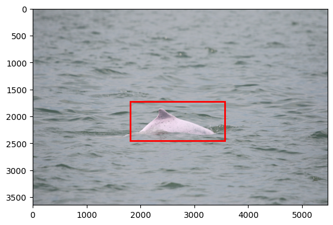
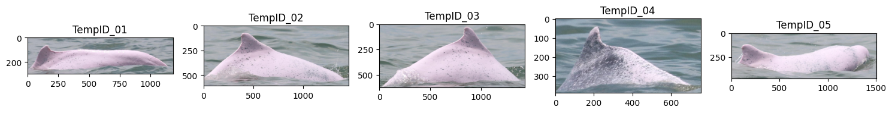

# Image Processing Pipeline with YOLO, UMAP, and KMeans

This repository offers an image processing pipeline that incorporates object detection, image renaming, cropping, and clustering. It utilizes YOLO model for object detection, UMAP and KMeans for dimensionality reduction and unsupervised clustering of processed images. The current example uses pre-trained weights on dorsal fins of Indo-Pacific humpback dolphin (_Sousa chinensis_).

## Features

- **Single Image Detection**: Detects objects in a single image and visualizes the results with bounding boxes using YOLO.
- **Batch Image Cropping**: Processes multiple images, cropping them based on detected objects, and saving the cropped images in a separate folder. Images without detected objects are saved in another folder.
- **Image Renaming**: Renames images based on a specified format, while preserving EXIF metadata.
- **Image Clustering**: Uses UMAP for dimensionality reduction and KMeans for unsupervised clustering of image features. Groups similar images into clusters for easier management.

## Installation

To get started, clone this repository:

```
bash
git clone https://github.com/your-username/image-processing-pipeline.git
cd image-processing-pipeline
```

## Install dependencies:

```
pip install -r requirements.txt
```

## Usage

1. Single Image Detection

- To run the detection on a single image:

```
image_analysis = ImageAnalysis(input_dir='test_data/', model_name='weights/sousa_dorsal_fin.pt')
image_analysis.detect_single_image('test_data/0001_20240807_HongKong_01_0926.jpg') # Path to a single image
```



2. Image Cropping with Batch Processing

- To process images in batch and crop based on detected objects:

```
image_analysis = ImageAnalysis(input_dir='test_data/', output_dir='output/', model_name='weights/sousa_dorsal_fin.pt')
image_analysis.process_images()
```

3. Image Clustering

- To cluster images based on their features using UMAP and KMeans:

```image_cluster = ImageCluster(input_dir='test_data/', n_individuals=5)
image_cluster.process_images() # Process images and categorize them into clusters
image_cluster.display_clusters() # Display one image from each cluster
```



## License

This project is licensed under the MIT License - see the LICENSE file for details.

## Disclaimer

The clustering results require human checking to ensure that the images are grouped properly.

Feel free to contribute to this project, suggest improvements, or report issues!
